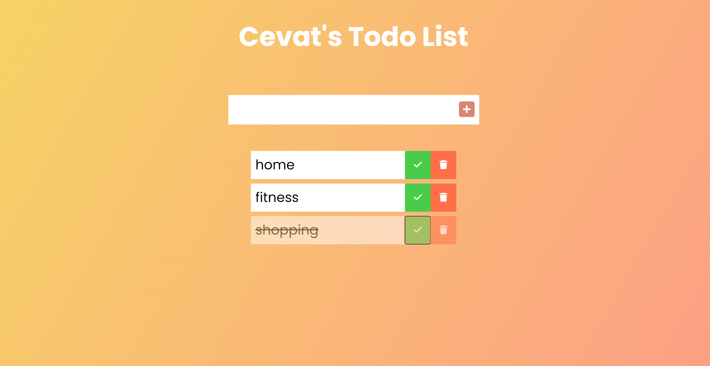

# My ToDo App

## Table of contents

- [Overview](#overview)
  - [Screenshot](#screenshot)
  - [Links](#links)
- [My process](#my-process)
  - [Built with](#built-with)
  - [What I learned](#what-i-learned)
  - [Continued development](#continued-development)
- [Author](#author)

## Overview

### Screenshot



This is project's simple view...

### Links

- Live Site URL: [Add live site URL here](https://morcicek.github.io/My-Todo/)

## My process

### Built with

- Semantic HTML5 markup
- CSS3
- Flexbox
- JavaScript DOM
- JavaScript Event

### What I learned

I learned Js Events and DOM with this project.Also I reinforced my knowledge about CSS and HTML and practiced for flexbox, positions..

To see how you can add code snippets, see below:

```html
<form>
  <input type="text" class="todo-input" />
  <button class="todo-button" type="submit">
    <i class="fas fa-plus-square"></i>
  </button>
</form>
```

```css
.todo {
  margin: 0.5rem;
  background: white;
  color: black;
  font-size: 1.5rem;
  display: flex;
  justify-content: space-between;
  align-items: center;
  transition: all 0.5 ease;
}
}
```

```js
const todoInput = document.querySelector(".todo-input");
const todoButton = document.querySelector(".todo-button");
const todoList = document.querySelector(".todo-list");

//Event Listeners
todoButton.addEventListener("click", addTodo);
todoList.addEventListener("click", deleteCheck);

//Functions

function addTodo(event) {
  //Prevent form from sumbitting
  event.preventDefault();
  //Todo DIV
  const todoDiv = document.createElement("div");
  todoDiv.classList.add("todo");
```

### Continued development

I still work on Web Development and want to build more project with JavaScript.

## Author

- Lınkedin - [Mehmet Cevat Morcicek](https://www.linkedin.com/in/mehmet-cevat-morcicek-b50a29178/)
- Twitter - [@morcicek_m](https://twitter.com/home?lang=en)
